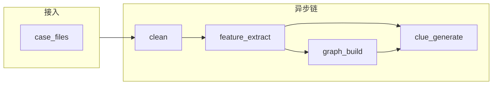

# 后端基础能力重构说明

本文档与代码库以下部分配套：

- ORM：`backend/model/case.py`（扩展）、`case_file.py`、`clue.py`、`analysis_task.py`、`audit_log.py`
- 错误码：`backend/core/error_codes.py`
- 服务边界：`backend/contracts/service_protocols.py`
- 异步契约：`backend/tasks/schemas/pipeline_io.py`

---

## 一、数据库表结构概要

### 1. `cases`（案件）

| 字段 | 类型 | 说明 |
|------|------|------|
| id | PK | 自增主键 |
| user_id | FK → users | 属主 |
| name / case_number / note | 文本 | 基本信息 |
| status | 字符串 | active / completed 等 |
| extra_metadata | JSON | 扩展：标签、外部系统 ID、业务配置 |
| created_at / updated_at | 时间 | 审计 |

索引：`user_id`、`(user_id, status)`（已有）。

### 2. `case_files`（案件-文件绑定）

| 字段 | 类型 | 说明 |
|------|------|------|
| id | PK | |
| case_id | FK → cases，级联删 | 案件 |
| file_id | FK → files，级联删 | 文件元数据 |
| role | 可空 | 数据角色：流水/话单/附件等 |
| sort_order | int | 展示排序 |
| created_at | 时间 | 绑定时间 |

约束：`UNIQUE(case_id, file_id)`。  
索引：`case_id`、`file_id`、`(case_id, created_at)`。

**设计意图**：所有分析、线索、图投影的输入文件**必须通过本表与 case 关联**，避免仅靠 `dataset` 字符串约定。

### 3. `clues`（线索）

| 字段 | 类型 | 说明 |
|------|------|------|
| id | PK | |
| case_id | FK → cases | 归属案件 |
| subject_key | 字符串 | 人物/实体主键（与图、业务对齐） |
| title / summary | 文本 | 标题与摘要 |
| status | 字符串 | open / confirmed / dismissed |
| risk_level / risk_score / category | | 风险与分类 |
| analysis_task_id | FK → analysis_tasks，可空 | 来源任务 |
| rule_hits / feature_snapshot / risk_prompts / extra_metadata | JSON | 规则命中、特征、提示、扩展 |
| created_at / updated_at | 时间 | |

索引：`case_id`、`(case_id, risk_level)`、`(case_id, subject_key)`、`analysis_task_id`、`created_at`。

### 4. `analysis_tasks`（分析任务 — 领域）

| 字段 | 类型 | 说明 |
|------|------|------|
| id | PK | 自增 |
| public_id | UUID 字符串，唯一 | 对外 API 标识 |
| case_id | FK → cases | **必填**，案件归属 |
| user_id | FK → users，可空 | 提交人 |
| task_type | 字符串 | clean / feature_extract / graph_build / clue_generate / composite |
| status | 字符串 | queued / running / succeeded / failed / cancelled |
| input_payload | JSON | 入参快照（file_ids、选项等） |
| result_ref | JSON | 结果引用（路径、子任务 id、统计） |
| error_message | 文本 | 失败信息 |
| celery_task_id | 字符串，可空 | 与 Celery 关联 |
| started_at / finished_at | 时间 | |
| created_at / updated_at | 时间 | |

索引：`case_id`、`(case_id, status)`、`user_id`、`celery_task_id`、`created_at`、`task_type`。

**与 `celery_task_runs` 区别**：后者为**运维监控**；本表为**业务幂等与结果追溯**。

### 5. `audit_logs`（审计）

| 字段 | 类型 | 说明 |
|------|------|------|
| id | PK | |
| user_id / case_id | 可空 | 系统行为可空用户 |
| action | 字符串 | 如 CASE_VIEW、FILE_BIND、EXPORT |
| resource_type / resource_id | | 资源类型与标识 |
| ip_address / user_agent | | 请求上下文 |
| detail | JSON | 扩展详情 |
| created_at | 时间 | |

索引：`user_id`、`case_id`、`action`、`created_at`、`(resource_type, resource_id)`。

---

## 二、服务层拆分（职责与接口）

正式接口见 **`backend/contracts/service_protocols.py`**（`Protocol`，无实现）。

| 服务 | 职责 | 说明 |
|------|------|------|
| **FileServicePort** | 上传登记、MinIO、**case_files 绑定**、按 case 列文件、解析可读文件 | 与旧 `file_service` 对齐演进 |
| **DataPipelineServicePort** | 针对某 case 下 artifact 跑流水线摘要 | 与 `data_pipeline_service` 对齐，**入参必须含 case_id + file_id** |
| **ClueServicePort** | 线索列表/详情/创建占位、与 analysis_task 关联 | 供 API 与线索生成任务回调 |
| **AnalysisServicePort** | 创建 `analysis_tasks`、投递 Celery、按 public_id/case 查询 | 统一异步入口 |
| **GraphServicePort** | 案件维度的可视化数据、触发投影类作业 | 与 Neo4j 适配器交互，**不写死在 api 层** |

---

## 三、统一 API 响应与错误码

### 响应结构（已实现）

```json
{
  "code": 0,
  "msg": "success",
  "data": {},
  "request_id": "..."
}
```

- **code=0**：成功；**非 0**：业务错误（常与 HTTP 200 + body 配合，见 `ServiceError`）。
- **request_id**：由中间件注入 `request.state.request_id`。

### 错误码

见 **`backend/core/error_codes.py`**（`ErrorCode` 枚举）。分段：40xxx 参数、401xx 认证、403xx 授权、404xx 不存在、409xx 冲突、42xxx 案件、43xxx 文件、44xxx 分析任务、45xxx 线索、46xxx 图、50xxx 系统。

业务层抛出 `AppError` / `ServiceError` 时携带 `code`，与枚举对齐。

### 鉴权方式

- **Authorization: Bearer &lt;JWT&gt;**（现有逻辑不变）。
- 可选 **X-Tenant-ID**（若启用多租户，与现有 `tenant` 头一致）。

### `case_id` 传递约定

| 场景 | 约定 |
|------|------|
| REST 路径 | `/case/{case_id}/...` 或 `/.../cases/{case_id}/...` |
| 查询参数 | 非资源型操作可 `?case_id=` |
| 请求体 | 批量任务在 JSON 内显式 `case_id` |
| 异步任务 | **所有** Celery payload 必含 `case_id`（及 `user_id`） |

**禁止**：仅依赖 `dataset=case-*` 而无服务端校验。

---

## 四、异步任务体系

### 任务类型与队列（逻辑名）

| 任务 | task_type / Celery name 建议 | 输入模型 | 输出模型 |
|------|------------------------------|----------|----------|
| 数据清洗 | `clean` | `PipelineCleanTaskInput` | `PipelineCleanTaskOutput` |
| 特征提取 | `feature_extract` | `FeatureExtractTaskInput` | `FeatureExtractTaskOutput` |
| 图构建 | `graph_build` | `GraphBuildTaskInput` | `GraphBuildTaskOutput` |
| 线索生成 | `clue_generate` | `ClueGenerateTaskInput` | `ClueGenerateTaskOutput` |

模型定义：**`backend/tasks/schemas/pipeline_io.py`**。

### 任务链路（Pipeline）



- **串行常见路径**：clean → feature_extract →（graph_build 与 clue_generate 可并行或依赖配置）。  
- **依赖传递**：通过 `analysis_task_public_id` 与 `result_ref` / `artifact_refs` / `feature_refs` / `graph_refs` 引用，**不在此文档展开业务字段**。

### 与 `analysis_tasks` 表协作

1. API 创建 `AnalysisTask` 行，`status=queued`，写入 `input_payload`。  
2. 投递 Celery，`celery_task_id` 回写。  
3. Worker 执行：更新 `running` → `succeeded`/`failed`，写入 `result_ref` 或 `error_message`。  
4. 下游任务读取上一跳 `result_ref`（由应用层解析，不在任务内硬编码业务）。

---

## 五、迁移与兼容

- 现有 `files` 表无 `case_id`：**历史数据**需一次性脚本补 `case_files` 或标记孤儿文件。  
- `CaseOut` 已增加可选 `extra_metadata`；旧行该字段为空。  
- 新表随 `Base.metadata.create_all()` 创建；生产环境长期建议引入 Alembic（另项）。

---

*维护：表结构或契约变更时请同步更新本文与 `PLATFORM_ARCHITECTURE_REFACTOR.md`。*
