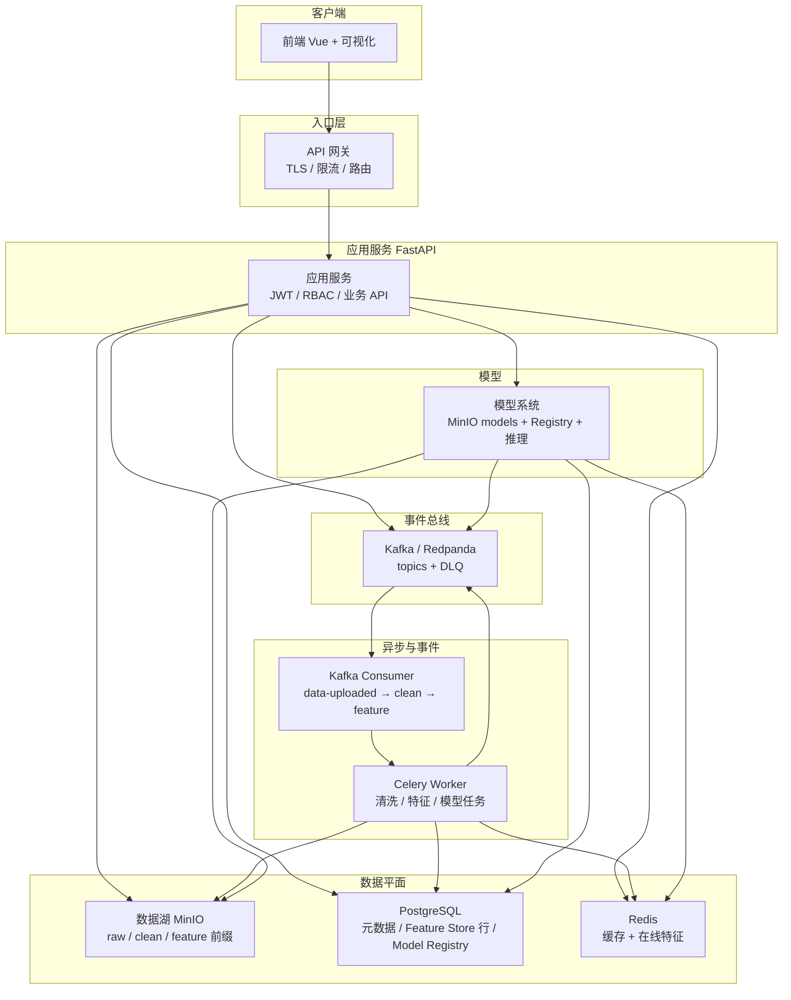

# 最终系统架构设计（数据湖 + 流批一体 + 高可用）

本文档对应「数据湖 / Kafka 流处理 / Spark 批处理 / Feature Store / 模型与反馈」整体设计与部署视图。

---

## 1. 逻辑架构图（组件全覆盖）

**组件清单（与任务 6 对齐）**

| # | 组件 | 说明 |
|---|------|------|
| 1 | 前端 Vue + 可视化 | 上传、任务状态、简单图表 |
| 2 | API 网关 | 统一入口、TLS、限流、路由（可 Nginx / Kong / APISIX） |
| 3 | 应用服务 | FastAPI：鉴权、文件、分析、模型、Registry |
| 4 | Celery | 重计算与可重试异步任务 |
| 5 | Kafka | 解耦流水线、可扩展消费者 |
| 6 | MinIO 数据湖 | raw / clean / feature 对象键规范 |
| 7 | Feature Store | PG 行存 + Redis 在线特征 |
| 8 | 模型系统 | MinIO `models` + Registry + 灰度 |
| 9 | Redis | 缓存、在线特征、限流 |
| 10 | PostgreSQL | 用户、文件元数据、特征、模型注册、反馈 |

---

## 2. 数据湖三层结构（MinIO 对象键）

物理桶沿用 `raw-data`（原始）与 `processed-data`（加工），**逻辑分层**由对象键前缀表达：

| 层 | 键前缀模式 | 说明 |
|----|------------|------|
| raw | `raw/{user_id}/{dataset}/{version}/{filename}` | 原始上传，业务上只追加 |
| clean | `clean/{user_id}/{dataset}/{version}/{filename}` | 清洗产出 |
| feature | `feature/{user_id}/{dataset}/{version}/{filename}` | 特征快照（JSON/Parquet 等），与 PG 特征互为补充 |

实现见 `backend/infra/data_lake.py` 与 `minio_client.build_object_name(..., layer=...)`。

---

## 3. 流批一体（核心思想）

| 路径 | 技术 | 数据范围 | 写入 Feature Store |
|------|------|----------|---------------------|
| 批 | Spark（或 `batch_job` Pandas 模拟） | 历史分区、全量回补 | 批量写 PG + 可选 MinIO feature 快照 |
| 流 | Kafka + Celery/Consumer | 实时上传、增量事件 | 在线 Redis + 异步刷 PG（与现有管线一致） |

两者共享 **同一套特征语义与版本号（feature version）**，推理与训练只认 Store，不区分数据来自批还是流。

---

## 4. 高可用与运维（任务 7）

**多实例部署**

- 应用服务 / Celery / Kafka Consumer **水平扩容**；Kafka 分区与消费者组保证顺序与负载均衡。
- PostgreSQL：主从 / 读写分离；连接池 + `pool_pre_ping`。
- Redis：哨兵或 Cluster；缓存与在线特征可设 TTL。
- MinIO：分布式模式或纠删码；多驱动器。

**服务降级**

- `KAFKA_ENABLED=false`：上传可走 Celery 直连清洗回退；核心读写仍可用。
- Kafka 不可用时：Producer 失败日志 + 不阻塞主路径（可配置）。
- Redis  miss：回源 PostgreSQL / MinIO；模型推理可只读离线特征。

**数据备份**

- PG：连续归档 / 云快照；定期逻辑 dump。
- MinIO：`mc mirror` 或生命周期转冷存。
- Kafka：保留期 + MirrorMaker 2 跨集群（按需）。

---

## 5. 端到端链路（数据 → 湖 → 特征 → 模型 → 预测 → 反馈）

1. **上传** → MinIO **raw** 前缀 + `files` 元数据 → Kafka `data-uploaded`（若开启）。
2. **清洗** → MinIO **clean** 前缀 + 新 `files` 行 → Kafka `data-processed`。
3. **特征** → Feature Store（PG 行 + Redis 在线）→ 可选 **feature** 前缀快照（批任务）。
4. **训练** → Feature Store 读特征 → 模型写 MinIO `models` + Registry → Kafka `model-trained`。
5. **预测** → Registry 选模型 + Feature Store 读特征 → 结果 → Kafka `prediction-done`。
6. **反馈** → PostgreSQL `feedbacks` → 阈值触发再训练（Celery / Kafka）。

---

## 6. 设计说明摘要（任务 8）

1. **数据湖**：以低成本对象存储为底座，按 **raw / clean / feature** 分层存放海量文件，元数据在 PG，计算贴近数据（Spark/Flink）而不堆在业务库。
2. **流批一体**：批处理负责 **历史一致性与大规模扫描**；流处理负责 **低延迟增量**；共享 Feature Store 避免「离线在线两套特征」导致模型漂移。
3. **Kafka 为核心**：统一 **事件契约**、削峰、解耦服务、可重放与多订阅方，是连接 API、Celery、实时特征与审计的枢纽。
