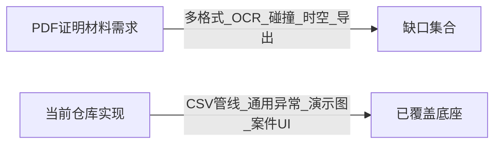

# 项目核心与 PDF 落地差距

## 项目核心（结合 CLAUDE.md 与代码现状）

本仓库对外定位为 **「检察侦查画像」数字检察演示全栈**：**FastAPI 单体后端 + Vue 3 SPA 前端**，配合 **Celery / Kafka** 异步、**PostgreSQL + MinIO + Neo4j + Redis** 数据面，提供从 **登录 → 案件管理 → 数据导入 → 异步分析 → 关系网络 → 风险画像 → 调查报告** 的闭环 UI（见 `frontend/src/router/index.ts`）。

**当前已具备的工程能力（与 PDF 总架构一致的部分）**：前后端分离、容器化与 K8s/CI 文档、JWT 与基础安全审计（如 `backend/core/security_audit.py`）、文件上传至 MinIO、基于 **Pandas** 的 CSV 读入与简化清洗/特征摘要（`backend/service/data_pipeline_service.py`）、**Isolation Forest** 异常占比评分（`backend/tasks/analyze_task.py`）、Neo4j 资金转账子图与 G6 展示（`backend/api/health.py` `/analysis/graph` + `frontend/src/pages/RelationshipNetwork.vue`）、调查报告页（`frontend/src/pages/InvestigationReport.vue`）。

**与证明材料中「智析侦源」产品愿景的差距**：仓库更接近 **可演示的技术底座 + 通用分析管线**，而 PDF 描述的 **司法职务犯罪专用解析引擎、多源碰撞算法库、时空热力与规则 DSL、侦查建议书导出** 等大量业务深度 **尚未按文落地**（详见下文）。

---

## 证明材料中尚未充分落地的部分（对照 PDF）

以下为按 PDF「需求分析 / 功能设计 / 实施计划」与当前实现逐项核对后的 **缺口**（优先级不分先后，按主题归类）。

### 1. 数据导入与多格式解析

| PDF 要求 | 当前实现要点 |
|----------|----------------|
| Excel、TXT、PDF、CSV、**数据库导入**；**正则 + OCR** 辅助解析 | 分析与管道多处 **显式限制为 `.csv`**（如 `backend/service/file_service.py` `only csv allowed`、`data_pipeline_service` 同）；未见 PDF/OCR/库表导入链路 |

### 2. 字段映射与标准化

| PDF 要求 | 当前实现要点 |
|----------|----------------|
| 内置标准字段映射字典 + **算法匹配与前端人工确认** | 无独立「映射配置 / 确认」接口与 UI；CSV 列名依赖约定（如图分析要求 `name`、`amount` 等，见 `backend/tasks/analyze_task.py`） |

### 3. 数据处理「四步」深度

| PDF 要求 | 当前实现要点 |
|----------|----------------|
| 联合主键去重；时间 **ISO 统一**；金额 **统一为元（两位小数）**；业务规则修正异常金额等 | `data_pipeline_service.standard_clean` 为去全空行 + 部分数值化；**无**联合主键去重、**无**时间字段标准化、**无**金额币种/精度统一；异常为 **2σ 计数**，非 PDF 中的业务规则集 |

### 4. 单一数据类型深度分析（银行 / 通话 / 出行）

| PDF 要求 | 当前实现要点 |
|----------|----------------|
| 银行：滑动窗口、高频小额、**3–6 跳环路（DFS）**、K-Means/DBSCAN、个人基线与 rolling 等 | **无** NetworkX/环路检测/聚类/窗口规则等实现（全库未检出 `networkx`、`R-Tree` 等） |
| 通话：深夜占比、**度/PageRank/介数**、**序列模式挖掘** | **无** 通话域模型与上述算法 |
| 出行：**敏感区域折返**、**R-Tree 时空伴随（±30min/500m）** | **无** 轨迹与空间索引实现 |

### 5. 多源数据碰撞与规则引擎

| PDF 要求 | 当前实现要点 |
|----------|----------------|
| 同时段/同地点/同事件比对；**自定义碰撞规则**；**碰撞结果清单 + 可疑程度** | 无「碰撞引擎」、无规则 DSL、无多表多人对齐任务与清单输出 |

### 6. 特征融合与画像输出

| PDF 要求 | 当前实现要点 |
|----------|----------------|
| 资金/通信/轨迹/图中心性 **加权综合风险**，权重按案件类型可调 | 前端有风险仪表盘与缓存（`frontend/src/store/case.ts`），后端风险来自 **通用特征 + 模型预测** 路径，**非** PDF 四维加权框架 |
| **自动生成线索摘要文本** | **无** 结构化摘要生成服务 |
| 四维画像：**经济状况、行为轨迹、社会关系、异常行为** 模块化 | UI 有章节占位，**无** 与业务域一致的四维数据模型与证据链字段 |

### 7. 可视化（时间轴 / 地图热力 / 资金流向专图）

| PDF 要求 | 当前实现要点 |
|----------|----------------|
| 时间轴、**地图热力**、关系图、行为图联动 | 有关系网络（G6）与统计卡片；**未检出** 热力图/地图/时间轴组件或 API（前端关键词检索为空） |
| 资金流向专图（与关系图区分） | 现为 Neo4j `TRANSFER` 通用展示，**非** PDF 所述资金流专题分析视图 |

### 8. 报告导出

| PDF 要求 | 当前实现要点 |
|----------|----------------|
| **一键导出 PDF/Word** 侦查建议书 | `InvestigationReport.vue` 为 **`window.print()`**，无服务端 PDF/Word 生成与模板 |

### 9. 数据模型与案件粒度

| PDF 要求 | 当前实现要点 |
|----------|----------------|
| 以「人」为顶层索引；**多源统一入库** | `Case`（`backend/model/case.py`）仅存案件元数据；上传虽带 `dataset=case-{id}`（`DataImport.vue`），但列表/分析使用 **全局 `listDbFiles`**，**未** 严格按案件隔离文件与分析范围 |

### 10. 图数据库与关系分析「业务完整性」

| PDF 要求 | 当前实现要点 |
|----------|----------------|
| 人/账户/地点/事件多类型节点；隐式关联、社区发现、路径扩展等 | Neo4j 侧主要为 **User + TRANSFER** 演示路径；**无** 从话单/轨迹自动构图与 PDF 所述多算法图分析 |

### 11. 安全合规（脱敏、导出审批）

| PDF 要求 | 当前实现要点 |
|----------|----------------|
| 脱敏、敏感导出审批、完整留痕 | 有 JWT、部分 **security_audit**；**无** 证明材料级别的脱敏策略与导出审批流 |

### 12. 实施计划中的交付物（非代码）

| PDF 要求 | 说明 |
|----------|------|
| 压力测试报告、演示视频、准确率抽样校验等 | 属项目管理交付物，**不在**当前仓库功能范围内，默认 **未体现** |

---

## 补充说明

- 若需与 PDF 章节严格一一对应，可在上表增加「PDF 页码 / 章节」列（本次按 PDF 文本结构归纳，未逐页标注）。

